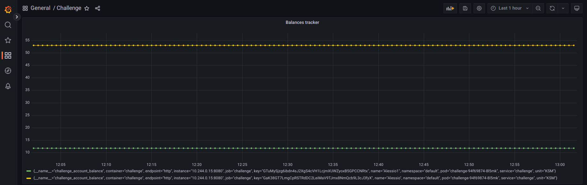
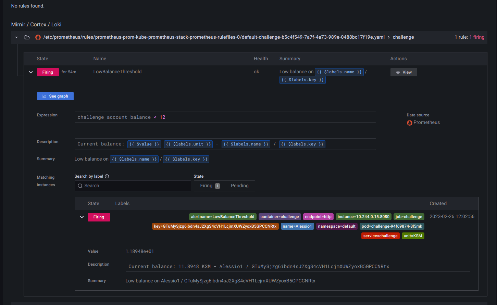
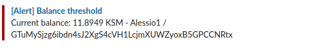

# Balance monitoring service
The account balance monitoring service

## Local run
Config file **.env**

```
# Launch local server
make run 
```

## Cluster Deployment

### Deploy service with helm on cluster
Config file **value.yaml**

```
# Deploy service to cluster
make helm-install 
```

## Update Parameters

Format list of accounts parameter (configs/accountList.json)

- local (.env) 
- Deployment (charts/value.yaml)

## Docker image generation
**The image is temporary publicly available on a registry**
```
#Update $IMAGE_REPO in Makefile and then execute
make build-push-image
```

## Prometheus / Grafana

### ServiceMonitor
- Access metrics to services matching labels

### PrometheusRule
- Fire an alert with balance information
- Based on expresssion balance < threshold

### AlertmanagerConfig
- Setup to forward message to slack channel

Create kubernetes secret containing private webhook API URL used by AlertmanagerConfig

```
#Update $SLACK_URL in Makefile and then execute
make create-secret-api-url
```


## App interatcion

### Monitoring the accounts balance


### Deployed rule displayed in Prometheus 


### Generated alert 
